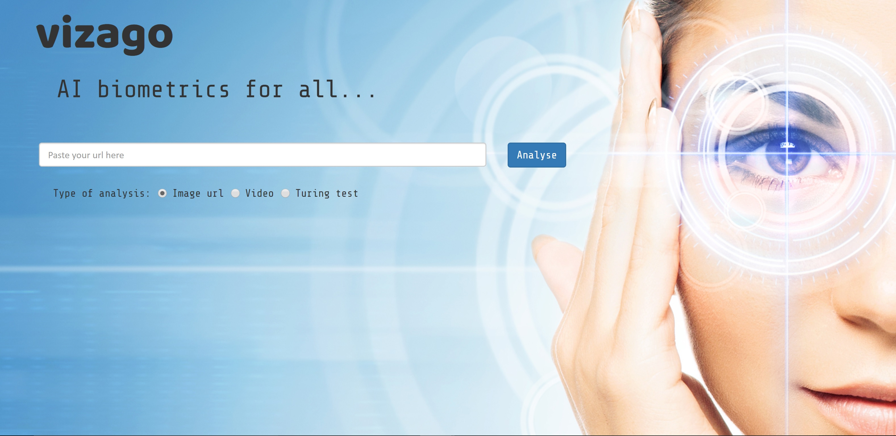
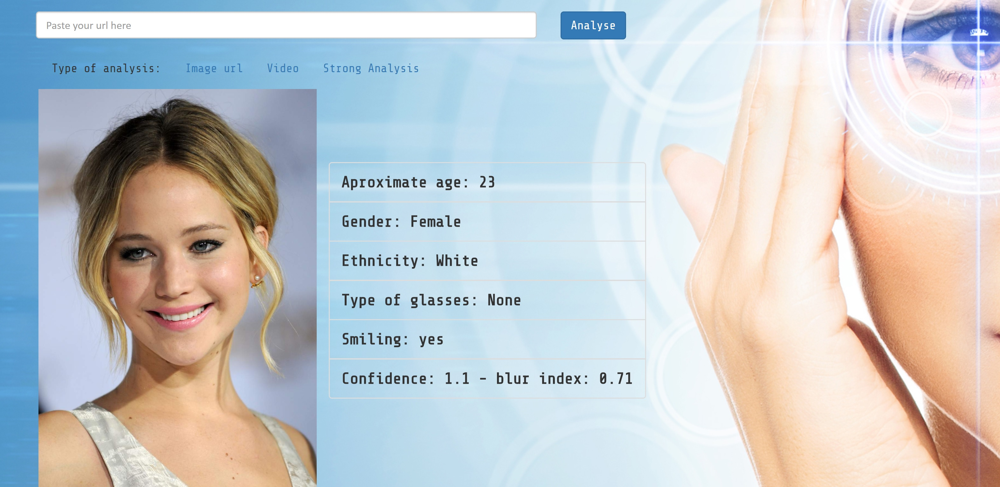

# VIZAGO
### A cool biometric application...!

## Analyse Image with url

curl -X POST --data "url" localhost:3000/analyse

## The information provided by the analysis will include:

- Lorem
- Ipsum
- Sepultum

## Compare faces and determine if it is a match 

