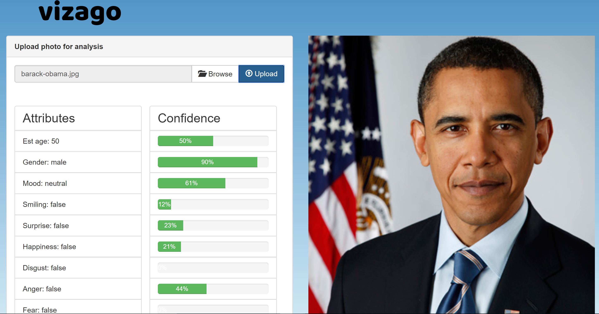
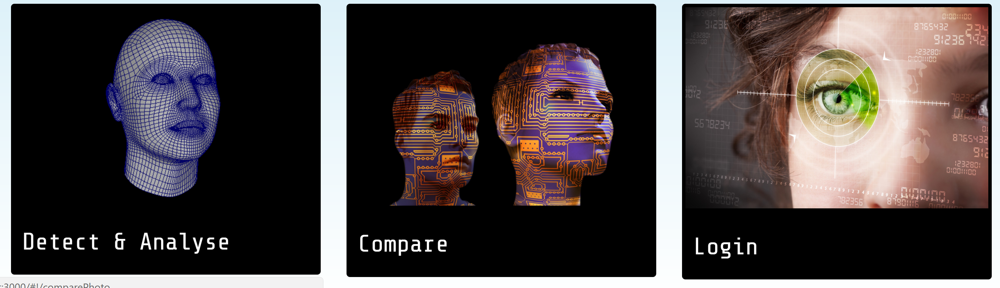

[](http://www.w3.org/) [](https://github.com/feross/standard)  [](http://getbootstrap.com/)  [](https://bower.io/) [](http://sass-lang.com/)  [](https://angularjs.org/) [](https://nodejs.org/) [](https://www.mongodb.com/) [](http://www.skylabcoders.com/)  
 

[](http://standardjs.com/)

# VIZAGO


This repository contains **Full-Stack** (**MEAN**) project visago. An app that is designed to make accesible to the general public the powerful practical applications of face recognition technology and biometrics. And also to have fun! 

Explore VISAGO here: [vizago](https://vizago.herokuapp.com/#!/)





VISAGO was developed with a **NodeJS** and **ExpressJS** server, **AngularJS** for the client and **MongoDB/Mongoose** for our DataBase.





## Installation

In order to install VISAGO you may clone this repository. [NodeJS](https://nodejs.org/), [npm](https://www.npmjs.com/) and [MongoDB](https://www.mongodb.com/) are required.

To run the server: 
```
XXXXX npm start
```
All dependencies will be installed automatically

You will need a ```.env``` file containing:
```
DB_URI=mongodb://<dbuser>:<dbpassword>@ds035703.mlab.com:xxxxx/xxxxx
CLOUD_NAME=sgarmendia
API_KEY=XXXXXXXXXXXXX
API_SECRET=XXXXXXXXXXXXXXXXXXXXXX
UPLOAD_FOLDER=uploads
```

Please contact me at sgarmendia@gmail.com in order to provide **API_KEY** and **API_SECRET**.

A mongoDB **MLAB** database can be setup by the user here: [MLAB](https://mlab.com/login/)

## API
This application relies on external API services for biometric analysis and data:

* [Face++](https://www.faceplusplus.com/)
* [SkyBiometry](https://skybiometry.com/)


## Lie Detector Disclaimer


The "lie detector" in this application was programmed mainly as a playful and fun way to enjoy the the biometric resources available. Even though it is based on sound aspects of psycological science, it is not intended as a real detector of lies or potential for lying. It is not valid for, and should not be used in any case for any other purpose than fun exchanges and innocent games. 

## Coding Style

The code has been developed under the [JavaScript Standard Style](http://standardjs.com/)


## Author

[Simon Garmendia](https://github.com/sgarmendia)


## Built With

* [SublimeText](http://https://https:/npmdejs.org/www.sublimetext.com) - Text editor


## Acknowledgments

- [SkylabCoders](https://github.com/SkylabCoders)
- [JuanMa](https://github.com/juanmaguitar)
- [Alex](https://github.com/agandia9) 
- [David]()
- [Angels]()
- [Bea]()

---

Copyright © 2017 SG. Keep coding!